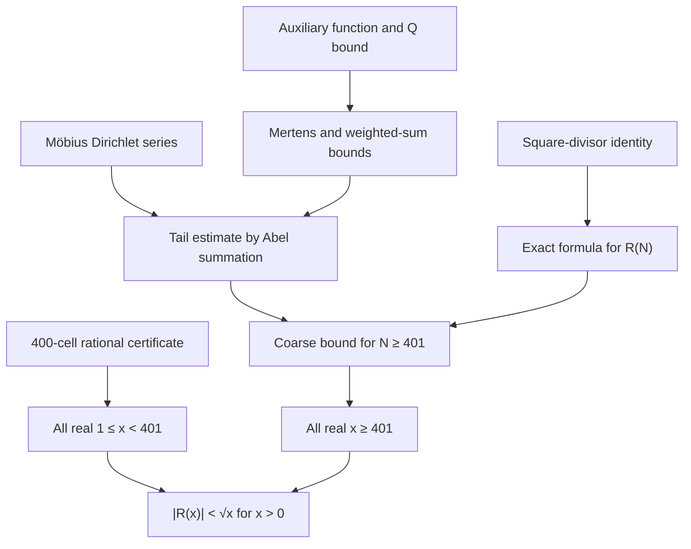

# Human proof and Lean correspondence

## 1. Statement and notation

Let

$$
Q(x)=\#\{n\in\mathbb N:1\le n\le x,\ n\text{ squarefree}\},\qquad
R(x)=Q(x)-\frac{6}{\pi^2}x.
$$

The formal result is

```lean
theorem MoserMacLeod.abs_R_lt_sqrt (x : ℝ) (hx : 0 < x) :
    |MoserMacLeod.R x| < Real.sqrt x
```

Moser and MacLeod state this for `x ≥ 1`. Lean proves it for every `x > 0`.
If `0 < x < 1`, then `⌊x⌋₊=0`, hence `Q(x)=0`, and

$$
|R(x)|=\frac6{\pi^2}x<\sqrt{x}.
$$

Natural-number variables are written `N`, real variables `x`. Thus Lean's
`squarefreeCountNat N` is $Q(N)$, while `squarefreeCount x` is
$Q(\lfloor x\rfloor)$.

## 2. Dependency diagram



The certificate node consists of ordinary proof terms. It does not invoke a
native evaluator.

## 3. Human-readable proof

### 3.1 The exact squarefree formula

For `n > 0`, Möbius inversion gives

$$
\sum_{d^2\mid n}\mu(d)=
\begin{cases}1,&n\text{ squarefree},\\0,&\text{otherwise}.
\end{cases}
$$

Summing over `1 ≤ n ≤ N` and interchanging finite sums yields

$$
Q(N)=\sum_{d\le\sqrt N}\mu(d)
       \left\lfloor\frac{N}{d^2}\right\rfloor. \tag{A}
$$

Writing

$$
\theta_{N,d}=\frac{N}{d^2}-\left\lfloor\frac{N}{d^2}\right\rfloor,
\qquad 0\le\theta_{N,d}<1,
$$

and using

$$
\sum_{d=1}^{\infty}\frac{\mu(d)}{d^2}=\frac1{\zeta(2)}
=\frac6{\pi^2}, \tag{B}
$$

we obtain the exact decomposition corresponding to equation (2) of the paper:

$$
R(N)=-\sum_{d\le\sqrt N}\mu(d)\theta_{N,d}
-N\left(\frac6{\pi^2}-
\sum_{d\le\sqrt N}\frac{\mu(d)}{d^2}\right). \tag{C}
$$

Lean expands the divisor bookkeeping in (A), one of the details suppressed in
the paper.

### 3.2 Elementary bounds

The periodic auxiliary function of Moser--MacLeod has period 30 and values in
`{0,1}`. Their convolution identity bounds `M(N)+1` by a squarefree count.
The formalization combines this with the convenient elementary estimate

$$
Q(N)\le \frac34N+1
$$

and a direct proof for the small values to obtain

$$
|M(N)+1|\le\frac18N+\frac34\quad(N\ge2),
\qquad
|M(N)|\le\frac18N+\frac74\quad(N\ge1). \tag{D}
$$

For arbitrary numbers `0 ≤ θ_d ≤ 1`, separating the positive and negative
values of `μ(d)` gives

$$
\left|\sum_{d\le m}\mu(d)\theta_d\right|
\le \frac{Q(m)}2+\frac{|M(m)|}2. \tag{E}
$$

This is the formal counterpart of the signed fractional-part estimate leading
to equation (7) of the paper. The constants in (D) are deliberately stated as
the constants actually used by this Lean proof; they are not presented as
verbatim copies of the paper's displayed estimates.

### 3.3 The Möbius tail

Apply finite summation by parts to `μ(d)/d²`, using the bound for `M(d)+1`
in (D). Lean keeps both endpoint terms and proves convergence before passing
to the limit. The result, combined with (E), yields for natural `N ≥ 401`

$$
|R(N)|<\frac{13}{16}\sqrt N+\frac{11}{4}. \tag{F}
$$

Since `N ≥ 401` implies `√N > 20`, this is strong enough, after allowing for
movement inside a unit cell, to prove the desired strict inequality for every
real `x ≥ 401`.

### 3.4 Why a finite certificate covers real x

For `N=⌊x⌋` and `x∈[N,N+1)`, `Q(x)` is constant, so

$$
R(x)=Q(N)-\frac6{\pi^2}x
$$

is affine. The proof encloses `6/π²` between `607/1000` and `609/1000`.
For each `1 ≤ N ≤ 400`, it verifies rational endpoint inequalities sufficient
to imply

$$
|Q(N)-\tfrac6{\pi^2}x|<\sqrt{x}
\quad\text{throughout }[N,N+1).
$$

The endpoint-to-cell passage is symbolic in `endpointOK_sound` and
`abs_R_lt_sqrt_of_lt_401`. Thus this is 400 finite integer/rational checks,
not an enumeration of real inputs.

Each check is a Lean theorem made from exact reductions, primality proofs,
Möbius recurrences, and `norm_num`. Rows are split into groups of 50 so that
review and recompilation remain local.

## 4. Paper/addendum to Lean index

The paper's numbering is used where the formal development implements that
step. “Adapted constants” means the mathematical step is the same but this
repository uses the explicitly displayed bounds in Section 3.2.

| Paper item | Lean declaration(s) | File | Relation |
| --- | --- | --- | --- |
| Definition of `Q`, `R` | `squarefreeCountNat`, `squarefreeCount`, `R` | `Base.lean` | Exact |
| Identity preceding (2) | `sum_moebius_square_divisors`, `squarefreeCountNat_floor_formula` | `Proof.lean` | Exact; bookkeeping expanded |
| Equation (2) | `R_nat_eq` | `Proof.lean` | Exact integer specialization |
| Equation (3), rough estimate | — | — | Not needed |
| Equation (4), squarefree count | `squarefreeCountNat_le_three_quarters` | `Base.lean` | Same role, adapted constant |
| Auxiliary function paragraph | `floorMobius_eq_one`, `auxF_periodic`, `auxF_eq_zero_or_one`, `sum_mu_auxF_eq_neg_one` | `Base.lean` | Expanded completely |
| Equations (5), (6) | `abs_mertensInt_add_one_le_count`, `abs_mertens_add_one_le`, `abs_mertens_le` | `Base.lean`, `Infrastructure.lean` | Same argument, constants (D) |
| Equation (7) | `sum_abs_muR_eq_count`, `abs_sum_muR_mul_le` | `Infrastructure.lean` | Abstract weighted form (E) |
| Abel paragraph before (8) | `finite_tail_bound`, `hasSum_mu_tail`, `abs_mu_tail_le` | `Proof.lean` | Endpoint and convergence details expanded |
| Equation (8) | tail component of `abs_R_nat_lt_coarse` | `Proof.lean` | Adapted constants |
| Equation (9), coarse estimate | `abs_R_nat_lt_coarse` | `Proof.lean` | Adapted bound (F), cutoff 401 |
| Finite verification after (9) | `finite_endpoint_certificate`, `endpointOK_sound`, `abs_R_lt_sqrt_of_lt_401` | `FiniteTable.lean`, `Base.lean`, `Infrastructure.lean` | Uniform real-cell proof |
| Final conclusion | `abs_R_lt_sqrt_of_one_le` | `Proof.lean` | Exact paper domain |
| Elementary extension | `abs_R_lt_sqrt` | `Proof.lean` | Extends domain to `x > 0` |

## 5. Lean declaration index

| Declaration | Mathematical job |
| --- | --- |
| `hasSum_mu_div_sq` | Identity (B) |
| `density_bounds` | Rational enclosure of `6/π²` |
| `endpointOK`, `endpointOK_sound` | One certified endpoint and its soundness |
| `finite_endpoint_certificate` | Dispatch all cells `1,…,400` |
| `abs_R_lt_sqrt_of_lt_401` | Every real `1 ≤ x < 401` |
| `abs_mertens_add_one_le`, `abs_mertens_le` | Bounds (D) |
| `abs_sum_muR_mul_le` | Weighted bound (E) |
| `finite_tail_bound` | Finite Abel summation with endpoints |
| `hasSum_mu_tail`, `abs_mu_tail_le` | Infinite Möbius tail |
| `sum_moebius_square_divisors` | Pointwise squarefree detector |
| `squarefreeCountNat_floor_formula` | Formula (A) |
| `R_nat_eq` | Exact decomposition (C) |
| `abs_R_nat_lt_coarse` | Coarse estimate (F) |
| `abs_R_lt_sqrt_of_one_le` | Paper's theorem for `x ≥ 1` |
| `abs_R_lt_sqrt` | Public theorem for `x > 0` |
| `sum_moebius_sq_eq_squarefreeCountNat` | Bridge to the MWE's `∑ μ(n)²` statement |

## 6. Trust and reproducibility

There is no `native_decide` in the development. In particular, the finite
range is not hidden behind `Lean.ofReduceBool` or the native compiler. The
certificate shards are large because their proof terms expose computation to
Lean's kernel.

`#print axioms MoserMacLeod.abs_R_lt_sqrt` reports only:

```text
propext
Classical.choice
Quot.sound
```

No solution theorem depends on `sorryAx`.

For independent comparison, `Challenge.lean` imports only `Mathlib` and holds
the target statement with an intentional `sorry`; `Solution.lean` repeats
exactly that statement with its proof. `comparator.json` records the permitted
axioms.
